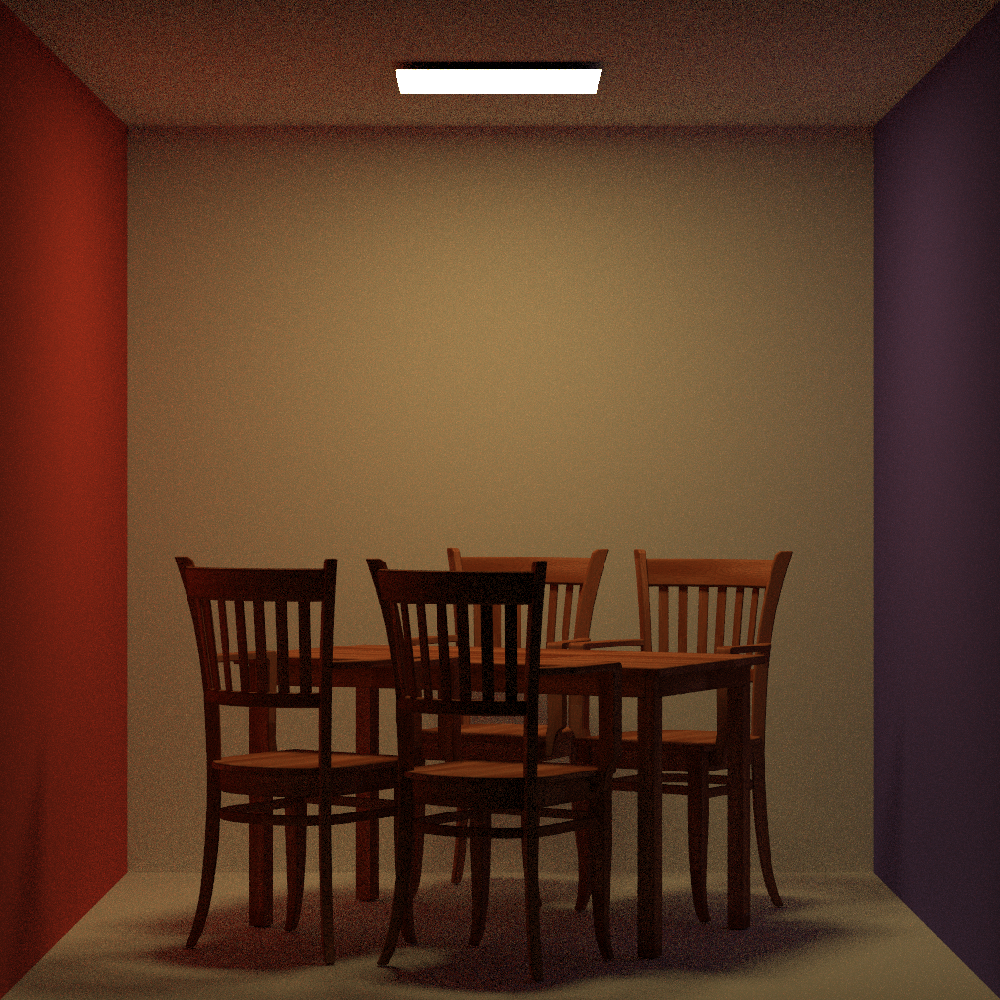

# 蒙特卡洛光线追踪

## 项目依赖

* stb_image
* tiny_obj_loader
* tinyxml2

## 实现功能

* 蒙特卡罗方法实现光线追踪
* Blinn-Phong光照模型
* BVH加速结构
* 直接光照的多重重要性采样
* 支持光线折射

## 命令行参数

* -spp：每个像素的采样数，默认为64
* -dir：场景文件夹所在的目录，默认为“example-scenes-cg21\”
* -scene：场景名，需保证场景文件夹、mtl文件和obj文件除后缀名外拥有同样名字，默认为"cornell-box"
* -o：输出文件路径，默认为“场景名.bmp"

## 运行结果

### cornell-box

#### 16spp

#### 64spp

#### 256spp

#### 1024spp

#### 4096spp

### bedroom

#### 16spp

#### 64spp

#### 256spp

#### 1024spp

#### 4096spp

### veach-mis

#### 16spp

#### 64spp

#### 256spp

#### 1024spp

#### 4096spp

